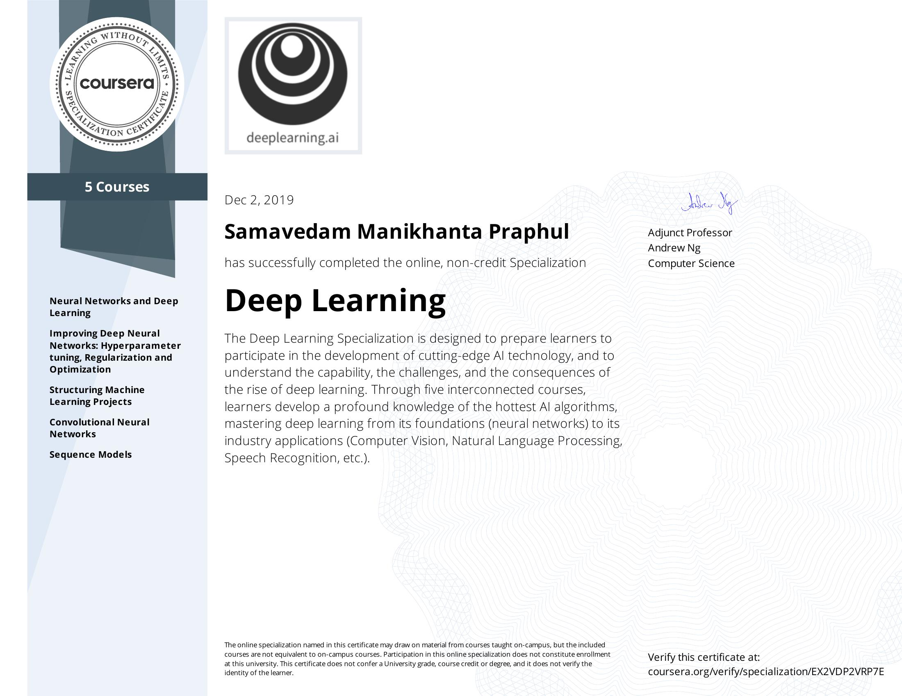
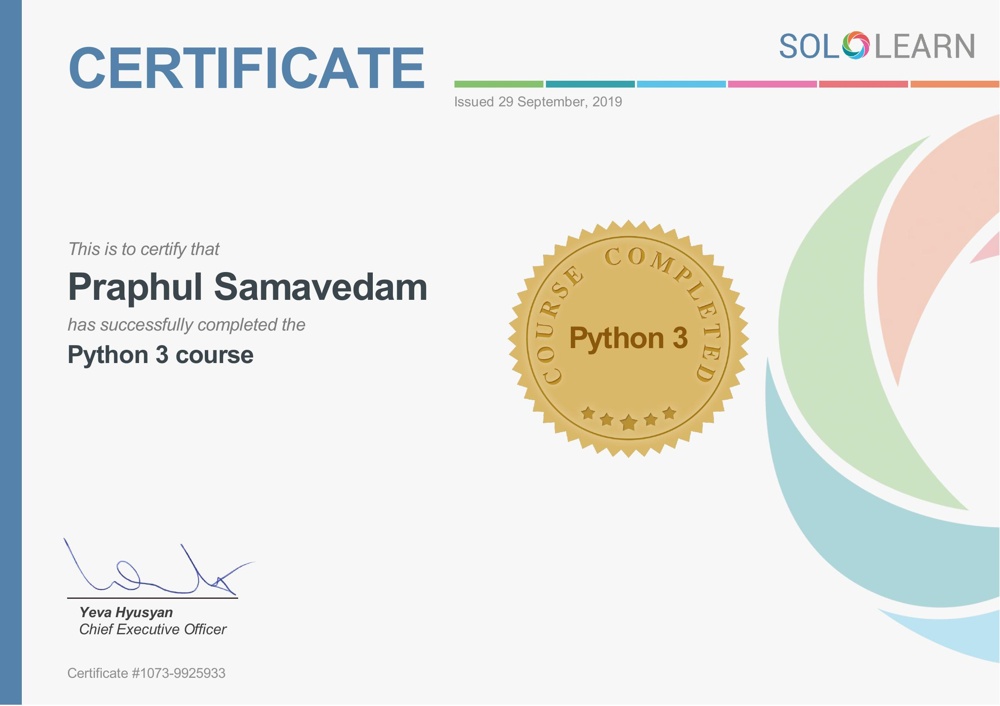

# Samavedam Manikhanta Praphul
### :heart: Machine learning
🌱 I’m a curious avid learner and loves to travel the untravelled path <br>
💬 Ask me about data science, machine learning and artificial intelligence. I love those interactions.<br>

### 😄 Inspirations:
* <a href="https://en.wikipedia.org/wiki/A._P._J._Abdul_Kalam" >```Dr. APJ Abdul Kalam Azad``` </a> - _"I learnt, every youth wants to be unique, that is, YOU! But the world all around you, is doing its best, day and night, to make you just "everybody else".Being like everybody else is convenient at the first glance, but not satisfying in the long vision.The challenge, therefore, my young friends, is that you have to fight the hardest battle, which any human being can ever imagine to fight; and never stop fighting until you arrive at your destined place, that is, a __UNIQUE YOU!__"_
<br>

### Reach me
[:mailbox_with_mail: Mail me](praphulsamavedam@gmail.com) <br />
<a href="https://www.linkedin.com/in/samavedam-manikhanta-praphul/">  View my LinkedIn profile </a> </br>
<a href="https://www.facebook.com/praphulchampion">  View my FB profile </a> </br>
<a href="https://community.alteryx.com/t5/user/viewprofilepage/user-id/132735">  View my Alteryx Profile </a></br>

### Certificates
<ul>
 <li><a href="https://www.coursera.org/account/accomplishments/certificate/EX2VDP2VRP7E">
 <b>Deep learning Specialization</b>
  
 </a></li>
<li><a href="https://www.coursera.org/account/accomplishments/certificate/8JLMS3ZHNDFM">
 <b>Data visualization using Tableau</b>
  
 </a></li>
 <li><a href="https://s3.us-east-2.amazonaws.com/ayx.certificates/20210109_AlterxDesignerAdvanced41kaNNTTU5kNRdlW6xmMaVnVtNGdFdkWUbipmVHplNBx2oJEShFDeUFaxcVW1RahWMt9ENJpnT.pdf">
  <b>Alteryx Advanced certified</b>
   
  </a></li>
<li><a href="https://s3.us-east-2.amazonaws.com/ayx.certificates/20200107_AlterxDesignerCore0TR61UejpXTx8GRaxmTFmb1clW5FTenSplNBx2oJEShFDeUFaxcVW1RahWMt90MrRVT.pdf">
 <b>Alteryx core certified</b>
  
 </a></li>
<li><a href="https://www.coursera.org/account/accomplishments/certificate/PL6V962K5L7H">
 <b>Web Data using python (Web scraping)</b>
  
 </a></li>
<li><a href="https://www.sololearn.com/Certificate/1073-9925933/pdf">
 <b>Python 3</b>
  
 </a></li>
 <li>Others check on my Linkedin Profile<div class="LI-profile-badge"  data-version="v1" data-size="medium" data-locale="en_US" data-type="vertical" data-theme="dark" data-vanity="samavedam-manikhanta-praphul"><a class="LI-simple-link" href='https://in.linkedin.com/in/samavedam-manikhanta-praphul?trk=profile-badge'>Samavedam Manikhanta Praphul</a></div></li>
</ul>

### Stats
<details>
  <summary>Github</summary>
  
</details>

### Bibliophile mode
1. :blue_book: [How to Change Others](https://bookstore.yssofindia.org/product/how-to-change-others)
2. :blue_book: [Overcoming Character Liabilities](https://bookstore.yssofindia.org/product/overcoming-character-liabilities)
3. :blue_book: [One minute manager](https://www.amazon.in/One-Minute-Manager-Kenneth-Blanchard/dp/8172234996/ref=tmm_pap_swatch_0?_encoding=UTF8&qid=&sr=)
4. :green_book: [Don't Cross My Heart](https://www.amazon.in/Cross-My-Heart-Alex-21/dp/0099574063/ref=tmm_pap_swatch_0?_encoding=UTF8&qid=&sr=)


##### Resources
* https://github.com/anuraghazra/github-readme-stats
<!--
**PraphulSamavedam/PraphulSamavedam** is a ✨ _special_ ✨ repository because its `README.md` (this file) appears on your GitHub profile.

[Todo]
Here are some ideas to get you started:

- 🔭 I’m currently working on ...
- 🌱 I’m currently learning ...
- 👯 I’m looking to collaborate on ...
- 🤔 I’m looking for help with ...
- 💬 Ask me about ...
- 📫 How to reach me: ...
- 😄 Pronouns: ...
- ⚡ Fun fact: ...
-->
